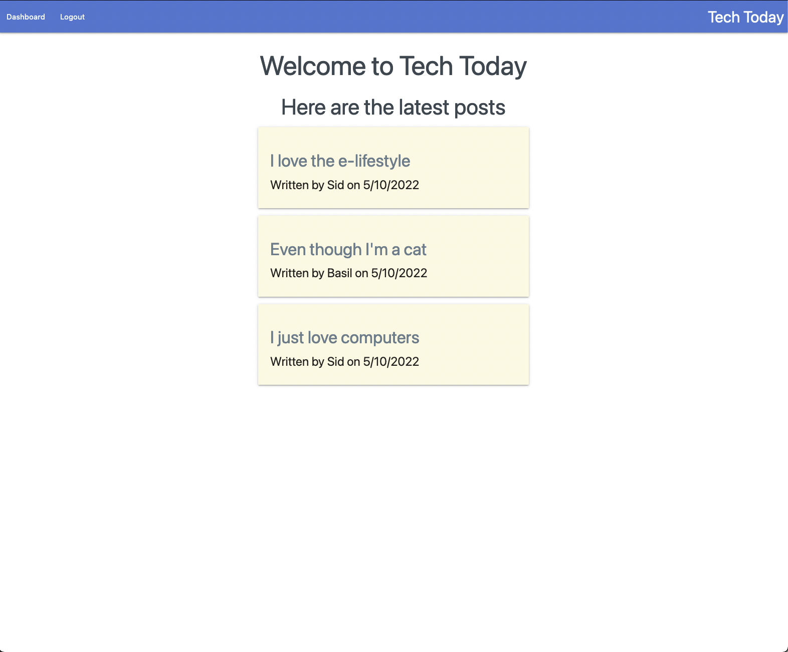

# techToday

## Description

An e-lifestyle blogging platform, designed for the modern day tech junkie.
Create an account, update and delete your posts, and comment on other user's posts.
Do you want to hear about the latest tech?
Do you want to write about a new website you discovered?
Are you trying to meet other e-minded cyberfolk to interface with?
This is the app for you.

## Link to Deployed Application

[Click to view the deployed application](https://tech-today.herokuapp.com/)



## Table of contents

- [Technologies Employed](#technologies-employed)
- [Key Functions](#key-functions)
- [License](#license)
- [Contact/Questions](#questions)
- [Summary](#summary-and-learning-points)

## Technologies Employed

| Techlogy             | Implementation/Use       |
| -------------------- | ------------------------ |
| Node.js              | JavaScript runtime       |
| Node Package Manager | Manage node packages     |
| dotenv               | Environment Variables    |
| Express.js           | Web framework            |
| sequelize            | ORM                      |
| bcrypt               | password encryption      |
| Heroku               | Deployment               |
| Handlebars           | Template and View engine |

## Key Functionality

### get a single post

This was the route that was "listening" for requests to view a single post.
It was particularly interesting because this request queried the database
for all three categories of information, all of which was served on the page.
Comments with authors, ordered by most recently posted, as well as post author.

```javascript
router.get("/posts/:id", async (req, res) => {
  try {
    const postData = await Post.findByPk(req.params.id, {
      include: [
        {
          model: User,
          attributes: ["name"],
        },
        {
          model: Comment,
          separate: true,
          order: [["date_created", "DESC"]],
          include: [{ model: User, attributes: ["name"] }],
        },
      ],
    });
```

### update Post

This was some really interesting front end code to write. It handled
revealing a hidden text box within each posting on the user dashboard.
When the user submitted that form, they are taken to the post, where they
can see the changes they made. It was particularly tricky because the posts
were iteratively generated by handlebars, so the script had to find extra
attributes within the created elements.

```javascript
  if (e.target.hasAttribute("up-id")) {
    const id = e.target.getAttribute("up-id");
    console.log(e.target.getAttribute("up-id"));
    document.getElementById(`updatePost${id}`).classList.remove("hide");
    document
      .getElementById(`updatePost${id}`)
      .addEventListener("submit", async function (e) {
        const body = document.getElementById(`updateText${id}`).value.trim();
        e.preventDefault();
        const res = await fetch(`api/posts/${id}`, {
          method: "PUT",
          body: JSON.stringify({ body }),
          headers: {
            "Content-Type": "application/json",
          },
        });
        if (res.ok) {
          document.location.replace(`posts/${id}`);

```

## License

[](https://www.gnu.org/licenses/gpl-3.0)

## Questions?

Please contact me at:

sgquin@gmail.com

Alternatively, visit my github:

https://www.github.com/sharkby7e

## Summary and Learning Points

I feel so proud of my first full stack application! This was an extremely long and hard
journey, but now I feel so much more confident with the MVC. I know that many other
frameworks use this paradigm, and I'm interested in learning more about them. If I had time,
I would allow users to visit the profiles of other users to view all of the posts that the other user had posted.
